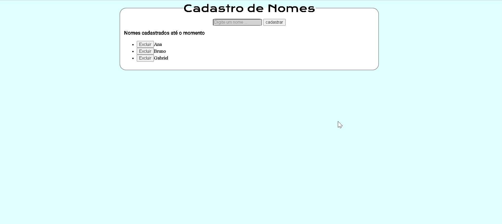

<h1>:rocket:CRUD EM JS</h1>

 

<h2>:bulb:Sobre</h2>

Este projeto possui um campo de texto onde o usuario cadastra um nome, ao clicar no botão "cadastrar" o nome carregado e colocado em uma lista abaixo. Ao lado do nome tem um botão que possibilita excluir o registro. Para alterar o nome basta clicar no nome e renomear no campo de texto.
 

<h2>🛠 Habilidades</h2> 

Utilização de elementos HTML
 

Utilização de CSS.
 

Manipulação de eventos com JavaScript
 
