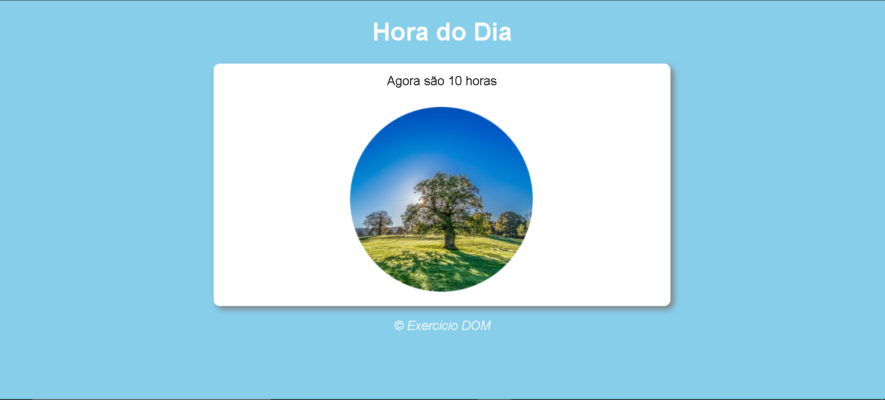

<h1>:rocket: Hora do Dia</h1> 
 

<h2>:bulb: Sobre</h2>

Este projeto foi feito com as ferramentas do DOM e JavaScript, ele pega a hora do seu sistema operacional e dependendo do horário muda a imagem e a cor de fundo. 
 
<h2>🔧 Habilidades</h2> 

Utilização de elementos HTML
 

Utilização de CSS.
 

Manipulação de eventos com JavaScript
 
