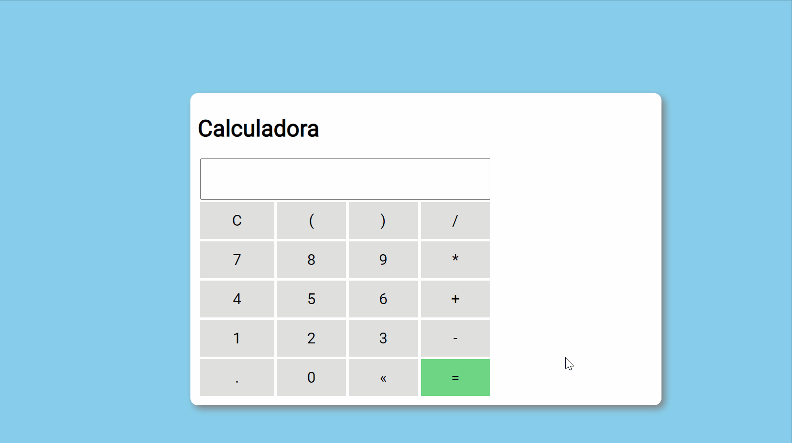

<h1>:rocket: Calculadora</h1> 
 
<h2>:bulb:Sobre</h2> 

Esta aplicação é mais para treinar os conceitos de Javascript, como functions Factory, elementos dinâmicos, css e algumas validações 
 
<h2>🛠 Habilidades</h2> 

Utilização de elementos HTML
 

Utilização de CSS.
 

Manipulação de eventos com JavaScript
 
