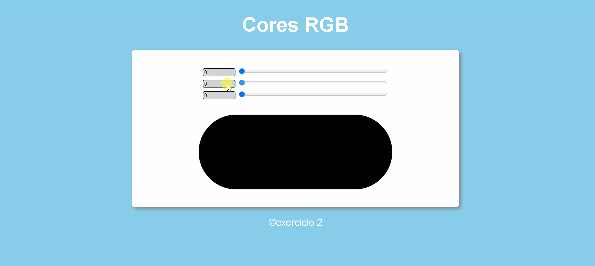

<h1>:rocket: Cores RGB</h1> 
 
<h2>:bulb:Sobre</h2> 

Esta aplicação contem três inputs do tipo “range”, cujos valores vão de 0 a 255 e representem, respectivamente, R (Red –Vermelho), G (Green –Verde) e B (Blue –Azul). Estas combinações de valores são utilizadas para preencher o plano de fundo da div
 
<h2>🛠 Habilidades</h2> 

Utilização de elementos HTML
 

Utilização de CSS.
 

Manipulação de eventos com JavaScript
 
