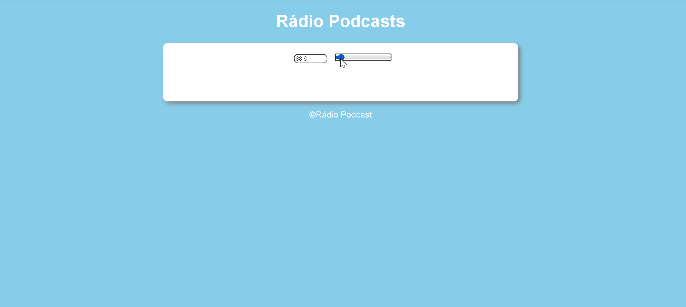

<h1>:rocket:Rádio Podcast</h1> 

Este projeto é uma rádio de podcast, ele busca a frequência certa mostra a o link do podcast com algumas informações sobre. Foi utilizado <strong>JavaScript, HTML, CSS</strong> 
 

<h2>👀 Modo de usar</h2> 

Coloquea rádio na frequencia desejada, aparecera um link e informações sobre o podcast seleciondao
 

<h2>:radio:Frequências</h2> 

Syntex: 88.5
 

FalaDev: 90.2
 

Lambda3: 92.3
 

DevNaEstrada: 93.9
 

StackOverflow: 95.8
 
